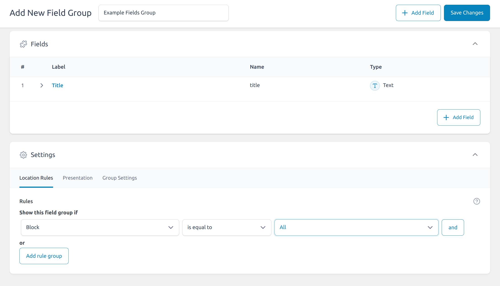

Advanced Custom Fields (ACF) Blocks are a feature of the ACF plugin for WordPress that allows developers to create custom blocks for the Gutenberg editor without needing to dive deep into JavaScript or React. ACF Blocks bridge the gap between WordPress’s modern block editor (Gutenberg) and traditional PHP-based custom fields, enabling developers to create powerful, flexible content editing experiences.

**Blocks can be reused across different pages and posts, ensuring consistency and saving development time.**

### Creating ACF Blocks

To create ACF Blocks, you’ll need the ACF Pro plugin. Here’s a step-by-step guide to creating your first ACF Block:

#### Step 1: Set Up Your Environment
Ensure you have the following:
- A WordPress site.
- ACF Pro plugin installed and activated.

#### Step 2: Register Your Block
In your theme’s functions.php file or a custom plugin, use the `acf_register_block_type` function to register your block.

```
if( function_exists('acf_register_block_type') ) {
    acf_register_block_type(array(
        'name'              => 'example',
        'title'             => __('Example Block'),
        'description'       => __('A custom example block.'),
        'render_template'   => 'template-parts/blocks/example/example.php',
        'category'          => 'formatting',
        'icon'              => 'admin-comments',
        'keywords'          => array( 'example', 'custom' ),
    ));
}
```

#### Step 3: Create the Block Template
Create a PHP template file for your block. This template file will be used to render the block’s content. For example, create a file named `example.php` or `example.blade.php` in `template-parts/blocks/`.

```
<div class="example-block">
    <h2><?php the_field('title'); ?></h2>
    <p><?php the_field('description'); ?></p>
</div>
```

#### Step 4: Add Custom Fields
Add custom fields to your block using ACF’s user interface. Navigate to Custom Fields -> Add New in the WordPress admin area, create a new field group, and set the location rules to display these fields when the block is equal to your custom block (example).


