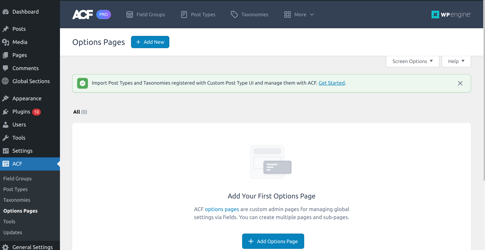

## **Understanding Custom Post Types and ACF Option Pages in WordPress**

WordPress is a powerful and flexible content management system that allows for extensive customization to meet various needs. Two of the most useful features for managing content in WordPress are Custom Post Types (CPTs) and Advanced Custom Fields (ACF) Option Pages. This document aims to provide a comprehensive guide on when to use CPTs and when to use ACF Option Pages, helping developers make informed decisions to structure their content effectively.

### **Custom Post Types (CPTs)**

Custom Post Types (CPTs) extend WordPress beyond the default Posts and Pages. They enable the creation of custom content types that can have their own distinct features and behaviors.

#### Implementation:
We can create a custom post type either via a custom code or by using Wordpress Plugins like [Custom Post UI](https://wordpress.org/plugins/custom-post-type-ui/). In the Pro feature of ACF plugin we also have an option to create Custom Post Types. So, it's up to you by which plugin you want to go with if you have a pro license of ACF then I will suggest definetely go with the ACF and get rid of the extra plugin depandancy.

The code implementation is also very straight forward. We have one WordPress method `register_post_type()` which registers/creates a custom post type. To read more about this function refer this [doc](https://developer.wordpress.org/reference/functions/register_post_type/)
Include the code given below in theme's function.php file.

```
function create_blog_post_type() {
    register_post_type('blog',
        array(
            'labels' => array(
                'name' => __('Blogs'),
                'singular_name' => __('Blog')
            ),
            'public' => true,
            'has_archive' => true,
            'rewrite' => array('slug' => 'blogs'),
        )
    );
}
add_action('init', 'create_blog_post_type');
```

This will create an custom post type in the admin dashboard and you can now create as many posts inside this custom post type(CPT). But now if we need to display the listing or content of these posts in UI we need to create templates and you can create custom templates for your CPT by adding template files like `single-blog.php` and `archive-blog.php` in your theme. `single-blog.php` is for the template file for displaying the UI for your blogs and `archive-blog.php` is the file to display the UI for listing or index page of blogs.

**Please Note:** In both ways either plugin or custom code to create CPT we need to create these template files.


### **ACF Option Pages**

ACF Option Pages allow for the creation of global settings and content that are not tied to any specific post or page, providing a centralized place for site-wide configurations. It provide a single location for managing site-wide settings.
They simplify the management of content that does not fit into the standard post/page structure.

#### Implementation:
We can use the ACF function to create an option page. Add the code below in finctions.php file.

```
if (function_exists('acf_add_options_page')) {
    acf_add_options_page(array(
        'page_title'    => 'Theme General Settings',
        'menu_title'    => 'Theme Settings',
        'menu_slug'     => 'theme-general-settings',
        'capability'    => 'edit_posts',
        'redirect'      => false
    ));
}
```

This function will create a setting page in admin dashboard then you can assign custom fields to the option page by ACF plugin and to retrieve the data use get_field() in your theme templates like this

```
$footer_text = get_field('footer_text', 'option');
echo $footer_text;
```

`footer_text` here is the custom field slug that you had created and assigned to the option page by ACF plugin.

**Please Note:** In the latest pro versions of ACF Plugin the functionality to create an option page comes by default so you don't need to create it via code you can directly create it by the plugins dashboard. Please find the attachment for the reference.



**Please Note:** Creating option page in any way is only available in ACF pro plugin.

## **Comparative Analysis**
There are some different use cases that will help to decide when to use Custom Post Types(CPTs) or when ACF Option Page:

1. We can use CPTs for content that needs categorization and structured management whereas ACF Option Pages can be used for global settings and content that do not fit the post/page model.
2. CPTs are ideal for specific content types that require their own archives and single pages. On the other hand, Option pages are best for site-wide settings and content appearing across multiple pages.
3. CPTs are better for scalable content that may grow over time whereas Option pages are suitable for static or infrequently changed setting.
4. Analyze how the choice will affect your SEO strategy, focusing on URL structure, meta information, and schema markup. In some cases we may not require the the post urls that are auto generating with each posts and we can disable that by passing the below two arguments to the post creation function:
```
    'publicly_queryable'  => false, // Disable single post pages
    'rewrite'             => false,
```