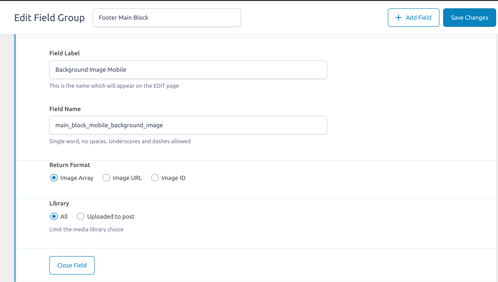

## **Image alt tag customization**

This section is required for the good SEO performance. In this we need to make sure we should include the alt attribute on image tag in HTML as well as pass a relevant value to it. We can pass the values in both ways either statically or dynamically.

To pass the value dynamically we first need to make sure there should be a custom field setup in the backend usinfg ACF Pro. While creating a custom field of image type we need to make sure that the output type of the field must be selected as Image Array. See the attachment below for reference.



After configuring the custom field correctly, It will return an array with the values like image_url, alt, title, description, etc. and then we can add these values to the image element like this:

>Javascript:

```

```

>PHP:

```
image->url }}
    alt={{ $data->image->alt }}
/>
```

[ **Note**: We can add dynamic values only for those image elements whose values are coming from the custom fields. Else we need to add one relevant value statically. ]
