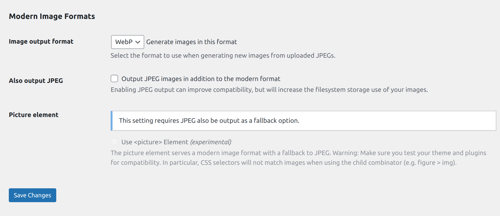

## **JPG/JPEG to Webp Conversion by using plugin**

WebP images are lightweight and now compatible with almost all browsers. Therefore, it is better to use WebP images instead of JPGs/JPEGs. This will be very helpful in improving webpage performance and speed optimization.

Now, the thing comes in mind that Do we need to manually convert all the jpgs/jpegs to WebP? The answer is no. There is a WordPress plugin that will do the job for you what you need to do is just install and activate the [Modern Image Formats](https://wordpress.org/plugins/webp-uploads/) developed by WordPress Performance Team.

As far as the plugin version 2.0.1 is released it gives you support for both WebP and AVIF image formats. You can select any in our case we are using WebP as AVIF is only supported in some latest versions of Chrome. So, there are cross browser compatibility isssue with AVIF format. If you want to read more about AVIF image format you can refer this [doc](https://web.dev/learn/images/avif).

Here you can see the basic settings that we need in our case.

**Please Note:** This plugin only converts the images that will get uploaded to media after activating the plugin. For all the previously uploaded images you need to upload the images again. So, It's better to consider this plugin at the very initial stage of starting development.